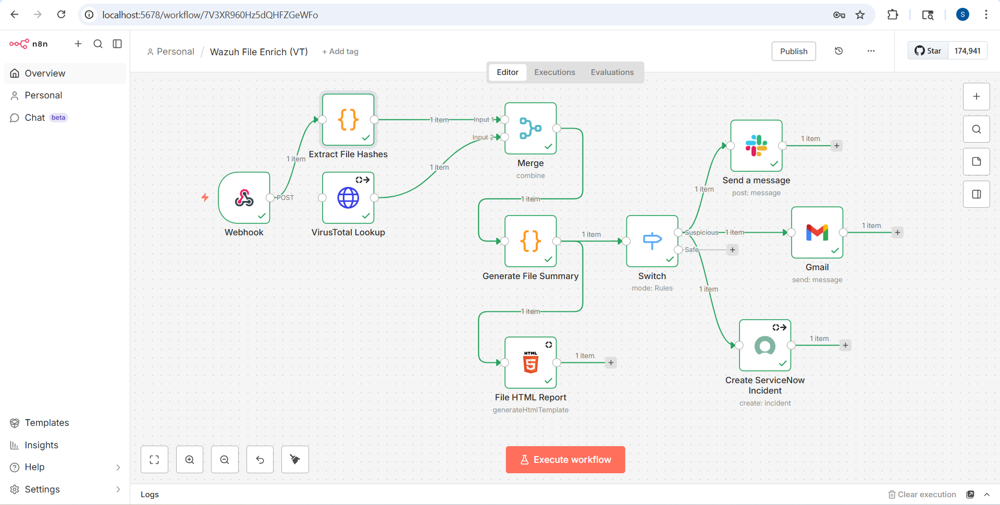
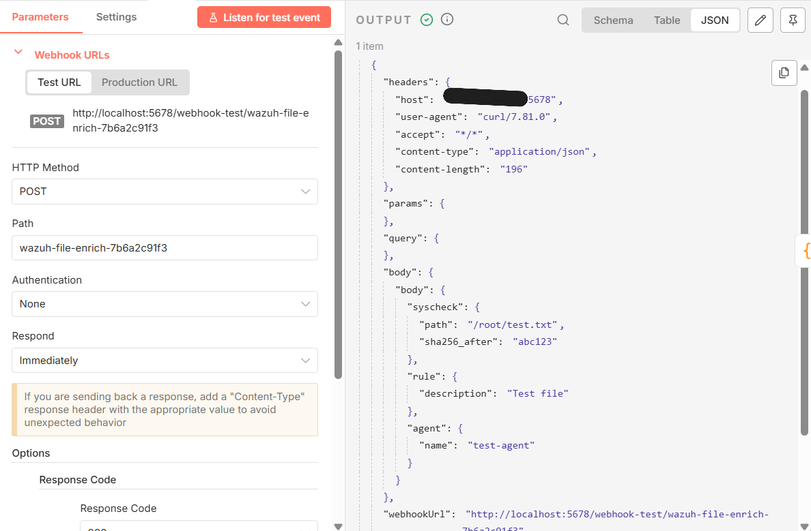
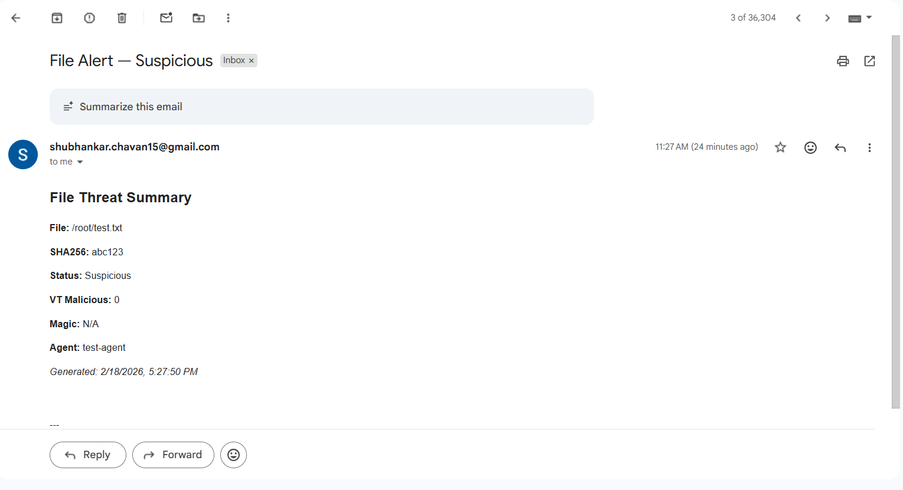
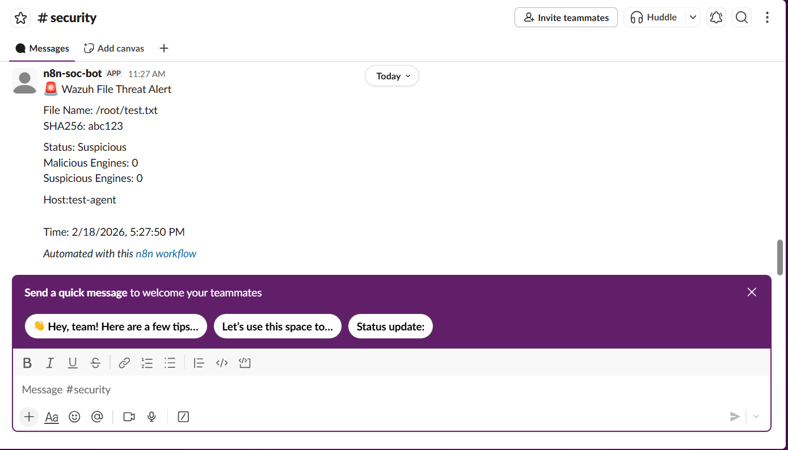
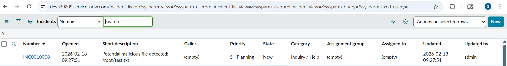

# Wazuh-n8n-Automated-File-Hash-Enrichment
 This project implements an automated **file alert enrichment** workflow using **Wazuh**, **n8n**, **VirusTotal**, **Slack**, **Gmail**, and **ServiceNow**.

---

**When a monitored file changes on a Wazuh agent:**

**1.** Wazuh sends a JSON alert to n8n.

**2.** n8n extracts file hashes and metadata.

**3.** SHA256 is sent to VirusTotal for threat enrichment.

**4.** A summary report is generated.

**5.** Alerts are routed:
- **Suspicious** → Slack, Gmail, ServiceNow incident.
- **Safe** → Optional logging or email.

---

## Task 0: Create n8n Credentials (One-Time Setup)

**Setup Instructions**

In n8n, navigate to **Credentials** section and create:

- **VirusTotal API** → Store your VIRUSTOTAL_KEY, label it virusTotalApi

- **ServiceNow** → Add basic auth or OAuth credentials, label it serviceNowBasic

- **Slack** → Add Bot OAuth token, label it slackOAuth2

- **Gmail OAuth** → Add email credentials, label it gmailCreds

**How to Verify**

- Use the built-in **Test** button or save and confirm no validation errors.

- Values should be stored and obscured when viewing credentials


## Task 1: Set Up Webhook to Receive Wazuh Alerts

**Setup Instructions**

- Create a new n8n workflow → ``Wazuh File Enrich (VT)``

- Add **Webhook Node:**

  - HTTP Method: ``POST``

  - Path: ``wazuh-file-enrich-<random>`` (make it long & unguessable)

  - Response: Default or ``{"status":"ok"}``

- Copy the full webhook URL.

**How to Verify**

- Save the workflow

- Test using a ``curl`` command with a test payload (``test_file_alert.json``)

- Check n8n Executions → Webhook node output should show raw Wazuh JSON.


## Task 2: Extract File Hashes and Metadata

**Setup Instructions**

- Add a **Code Node (JavaScript)** connected to Webhook.

- Paste the following code:

```
const body = items[0].json.body || {};
const syscheck = body.syscheck || {};
const rule = body.rule || {};

const md5 = syscheck.md5_after || null;
const sha1 = syscheck.sha1_after || null;
const sha256 = syscheck.sha256_after || null;
const filePath = syscheck.path || null;

const description = rule.description || 'No description';
const agent = body.agent?.name || 'unknown';
const level = rule.level || 'unknown';

return [{
  json: {
    type: 'file_alert',
    md5,
    sha1,
    sha256,
    file_path: filePath,
    description,
    agent,
    level,
    original_alert: body
  }
}];
```


**How to Verify**

- Run the workflow with a test payload

- Code node output should include sha256, file_path, and agent.

- Adjust extraction paths if null values appear.


## Task 3: Query VirusTotal for File Hash

**Setup Instructions**

- Add **HTTP Request Node** connected to **Code Node:**

  - Method: ``GET``

  - URL (expression): ``https://www.virustotal.com/api/v3/files/{{$json.sha256}}``

  - Authentication: Header → ``x-apikey`` → Select ``virusTotalApi`` credential

  - Response Format: ``JSON``

  - Enable **Continue on Fail = true**

**How to Verify**

- Test with known SHA256 hash:

  - ``200 OK`` → ``last_analysis_stats exists``

  - ``404`` → Hash not in VT (acceptable)

  - ``401`` → Check API key

  - ``429`` → Rate limit reached; consider throttling.

## Task 4: Generate File Summary and Threat Score

**Setup Instructions**

- Add **Code Node** after **VirusTotal node:**

```
const vt = items[0].json || {};
const data = vt.data?.attributes || {};

const summary = {
  SHA256: vt.data?.id || items[0].json.sha256 || 'N/A',
  Name: data?.meaningful_name || items[0].json.file_path || 'Unknown',
  Magic: data?.magic || 'N/A',
  Malicious: data?.last_analysis_stats?.malicious || 0,
  Suspicious: data?.last_analysis_stats?.suspicious || 0,
  Undetected: data?.last_analysis_stats?.undetected || 0,
  Harmless: data?.last_analysis_stats?.harmless || 0,
  Tags: (data?.tags || []).join(', '),
  Reputation: data?.reputation || 0,
  Description: data?.popular_threat_classification?.suggested_threat_label || 'No Label',
  Agent: items[0].json.agent || 'Unknown',
  Generated_At: new Date().toLocaleString('en-IN', { timeZone: 'Asia/Kolkata' })
};

// Status rule
summary.Status = (summary.Malicious > 0 || summary.Suspicious > 0) ? 'Suspicious' : 'Safe';

return [{ json: { summary } }];
```

**How to Verify**

- Confirm summary object contains: ``SHA256``, ``Name``, ``Status``, ``Agent``, ``Generated_At``.

- Test with known malicious hash → ``Status = Suspicious``.


## Task 5: Build HTML Report

**Setup Instructions**

- Add **HTML Node** after **Summary Code Node**:

```
<h2>File Threat Summary</h2>
<p><strong>File:</strong> {{$json.summary.Name}}</p>
<p><strong>SHA256:</strong> {{$json.summary.SHA256}}</p>
<p><strong>Status:</strong> {{$json.summary.Status}}</p>
<p><strong>VT Malicious:</strong> {{$json.summary.Malicious}}</p>
<p><strong>Magic:</strong> {{$json.summary.Magic}}</p>
<p><strong>Agent:</strong> {{$json.summary.Agent}}</p>
<p><em>Generated: {{$json.summary.Generated_At}}</em></p>
```

**How to Verify**

- Preview HTML node → confirm values populate correctly.


## Task 6: Route Based on Threat Status

**Setup Instructions**

- Add **Switch Node** after **HTML node**:

  - Value: ``{{$node["Generate File Summary"].json.summary.Status}}``

  - Condition branch: ``equals → Suspicious``

  - Default branch: ``Safe``

**How to Verify**

- Test **Safe** → Flow ends or logs/email only

- Test **Suspicious** → Triggers downstream Slack, Gmail, ServiceNow.


## Task 7: Create ServiceNow Incident (Suspicious Path)

**Setup Instructions**

- Connect **ServiceNow Node** to **Switch → Suspicious branch**:

   - Resource: ``Incident``

   - Operation: ``Create``

   - Short description: ``Potential malicious file detected: {{$json.summary.Name || 'Unknown'}}``

   - Description: ``{{$node["HTML"].json}} or {{$json.summary | json}}``

   -  Credentials: ``serviceNowBasic``

**How to Verify**

- After a suspicious run → ServiceNow UI shows new incident.

- Example: ``/incident_list.do`` to view all incidents.


## Task 8: Send Slack Notification (Suspicious Path)

**Setup Instructions**

- Connect **Slack Node** to **Switch → Suspicious branch:**

   - Channel: ``#security`` (or preferred)

   - Message:
```
File threat: {{$json.summary.Name || 'Unknown'}}
SHA256: {{$json.summary.SHA256}}
Status: {{$json.summary.Status}} | VT Malicious: {{$json.summary.Malicious}}
```

- Credentials: ``slackOAuth2``

**How to Verify**

- Suspicious alert → Slack channel receives message.


## Task 9: Send Email Notification (Optional – Both Paths)

**Setup Instructions**

- Add **Gmail Node** connected to both Switch branches (or just one):

  - To: SOC mailbox

  - Subject: File Alert — ``{{$json.summary.Status}}``

  - Body: ``{{$node["HTML"].json}}``

  - Credentials: ``gmailCreds``

**How to Verify**

- Inbox receives alert.

- Check Spam if not delivered.


## Task 10: Configure Wazuh Integration and Testing

**Part A: Wazuh Manager Configuration**

- SSH into Wazuh server → edit ``/var/ossec/etc/ossec.conf:``

```
<integration>
  <name>custom-n8n</name>
  <hook_url>https://your-n8n.example.com/webhook/wazuh-file-enrich-7b6a2c</hook_url>
  <level>5</level>
  <alert_format>json</alert_format>
</integration>
```

- Save and restart: ``sudo systemctl restart wazuh-manager``

**Part B: Test Payload**

```
{
  "body": {
    "syscheck": {
      "path": "/root/test.txt",
      "sha256_after": "abc123"
    },
    "rule": { "description": "Test file" },
    "agent": { "name": "test-agent" }
  }
}
```

- Send test:
```
curl -X POST -H "Content-Type: application/json" -d @test_file_alert.json https://your-n8n.example.com/webhook/wazuh-file-enrich-7b6a2c
```

**How to Verify**

- n8n execution → full workflow executed

- Email and Slack notifications received

- ServiceNow incident created.

---

## Conclusion

This workflow successfully **automates file alert enrichment:**

- Real-time monitoring: Wazuh sends file change alerts.

- Threat intelligence: VirusTotal enriches the alert with maliciousness scores.

- Centralized notifications: Alerts are sent to **Slack**, **Gmail**, and **ServiceNow**.

- Incident tracking: ServiceNow incidents are automatically created for suspicious files.

- Configurable & scalable: Easy to extend to additional alert sources, thresholds, or destinations.

**Result:** SOC teams can immediately detect, enrich, and respond to file threats with minimal manual intervention.

---

## Project Screenshots

### 1. n8n Workflow


### 2. Webhook Execution / File Hash Received


### 3. Gmail Notification


### 4. Slack Notification


### 5. ServiceNow Ticket Created


